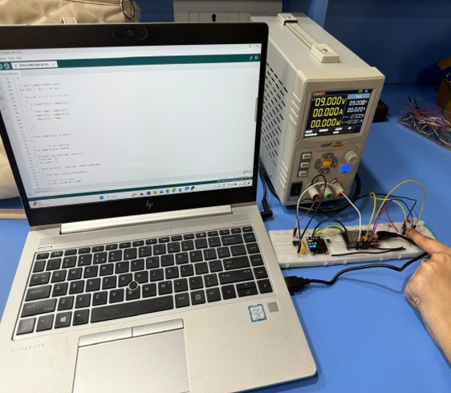
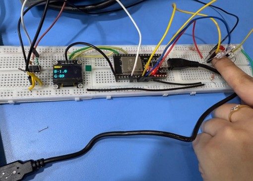

# Detection of Glucose and Bilirubin in Neonates

## Overview

This project presents a portable, low-cost, and non-invasive optical sensing system for estimating glucose and bilirubin levels in neonates. The system utilizes optical biosensing, signal processing, and embedded computing to provide real-time monitoring without requiring invasive blood sampling.

Neonatal hypoglycemia and jaundice are common conditions that require continuous monitoring. Conventional diagnostic methods involve blood collection, which can be painful and difficult to perform repeatedly in newborns. This project aims to provide a safer, non-invasive alternative using optical sensing techniques.

---

## Objectives

- Develop a non-invasive monitoring system for neonatal glucose and bilirubin detection.
- Reduce the need for invasive blood sampling.
- Provide real-time measurement using embedded hardware.
- Enable low-cost point-of-care diagnostics for neonatal healthcare.

---

## System Architecture

### Hardware Components

- Multi-Wavelength Optical Sensor
- Silicon PIN Photodiode
- Transimpedance Amplifier
- High-Resolution ADC
- ESP32 Microcontroller
- OLED Display

### Software Components

- Arduino IDE
- ESP32 Firmware
- Signal Processing Algorithms
- OLED Display Interface

---

## Working Principle

1. Light from multiple wavelengths is directed into neonatal tissue.
2. Tissue absorption characteristics vary with glucose and bilirubin concentration.
3. Reflected optical signals are detected by a silicon PIN photodiode.
4. The signal is amplified using a transimpedance amplifier.
5. The ESP32 reads the analog signal through its ADC.
6. Signal processing algorithms estimate bilirubin and glucose concentrations.
7. Results are displayed in real-time on an OLED display.

---

## Project Structure

```text
Neonatal-Glucose-Bilirubin-Detection
│
├── Images
│   ├── Setup.jpg
│   └── Output.jpg
│
├── ESP32_Code
│   ├── ESP32_Main.ino
│   ├── SignalProcessing.h
│   ├── SignalProcessing.cpp
│   ├── Display.h
│   └── Display.cpp
│
└── README.md
```

---

## Hardware Setup



---

## Output



---

## Source Code

### ESP32_Main.ino

Main program responsible for:
- Sensor initialization
- Data acquisition
- Signal processing
- OLED display updates

### SignalProcessing.h

Contains function declarations for:
- Sensor initialization
- Voltage acquisition
- Bilirubin estimation
- Glucose estimation

### SignalProcessing.cpp

Implements:
- ADC signal acquisition
- Sensor voltage calculation
- Bilirubin concentration estimation
- Glucose concentration estimation

### Display.h

Contains OLED display function declarations.

### Display.cpp

Handles:
- OLED initialization
- Real-time display of bilirubin values
- Real-time display of glucose values

---

## Features

- Non-Invasive Measurement
- Real-Time Monitoring
- Portable Design
- Low-Cost Implementation
- ESP32-Based Embedded System
- OLED Display Interface
- Optical Biosensing Technology

---

## Applications

- Neonatal Intensive Care Units (NICU)
- Point-of-Care Diagnostics
- Home Healthcare Monitoring
- Rural Healthcare Centers
- Continuous Neonatal Monitoring

---

## Future Enhancements

- Machine Learning-Based Calibration
- Mobile Application Integration
- IoT Connectivity
- Cloud-Based Monitoring
- Clinical Validation with Larger Datasets
- Wearable Sensor Integration

---

## Technologies Used

- Biomedical Instrumentation
- Optical Biosensing
- Embedded Systems
- ESP32
- Arduino IDE
- Signal Processing
- OLED Display Technology

---

## Results

The developed prototype demonstrates the feasibility of estimating glucose and bilirubin levels non-invasively using optical sensing techniques and embedded signal processing.

---

## Authors

**Janasruthika P R**  
B.E Biomedical Engineering  
Bannari Amman Institute of Technology

**Jeevika Harshine S**  
B.E Biomedical Engineering  
Bannari Amman Institute of Technology

---

## License

This project is developed for academic and research purposes.
